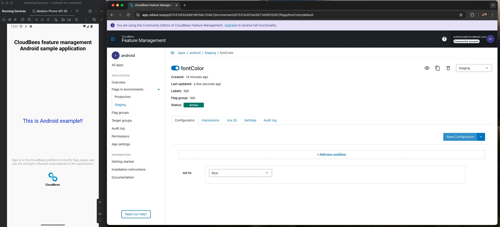

# Example Kotlin Android application for CloudBees platform Feature management
Use this example application to integrate with the CloudBees platform and test feature management. After integrating, watch the application display change in response to any updates you make to flag values in the platform.

In the example Kotlin application, the ROX SDK is already set up, and feature flags are already coded in.

## Running This Project
To get started with the android-fm-example project, follow these steps:

1. **Get the SDK key:** 
    - Create a CloudBees Feature management account. See [Signup Page](https://cloudbees.io/signup) to create an account.
    - Locate and copy your SDK key:
          -- Navigate to Feature management > Flags.
          -- Select an application.
          -- Select the copy button next to the SDK key on the page.
      -- If the SDK has not been installed: 
         -- Navigate to Feature management > Flags.
         -- Select the Installation instruction buttons on the top right-hand side of the page.
         -- The UI guides you through creating an environment, linking the environment to an application, and installing the SDK.
      
2. **Clone the Repository:** 
Clone the android-fm-example repository to your local machine using Git:

```shell
git clone git@github.com:cloudbees-io/android-fm-example.git
```
3. **Install ROX dependency:**
   - Add the following in the dependencies block of your build.gradle file:
   `implementation("io.rollout.rox:rox-android:5.0.5")`
   - After adding the dependency, sync the project.
 
4. **Open the Project:**
 
    - Reopen your project in Android Studio.

5. **Setup key from Cloudbees account:** 

    - In the AndroidManifest.xml file, replace the `<Your Cloudbees Environment API Key>` with your corresponding API key:
   
    ```
        <meta-data
            android:name="rox.apiKey"
            android:value="<Your Cloudbees Environment API Key>" />
    ```

6. **Run the android-fm-example App:** 

    - After running the application, the flag name is automatically added to your CloudBees dashboard.

## Use the platform to update flag values

Now that your application is running, go to Feature management, and select the application to display the flags available in the example application:

Table 1. Feature flags in the example application.

| Flag name           | Flag type  | Description                    |
|---------------------|------------|--------------------------------|
| `showMessage`| Boolean | Turns the message show or hide |
| `message`| String | Sets the Message string.|
| `fontColor`| String | Sets the font color. The flag value has the following variations: red, green, yellow, or blue.|
| `fontSize` | Int32   | Sets the font size in pixels. The flag value has the following variations: 12, 14, or 18.|
| `specialNumber` | Double   | Sets the number with double. The flag value has the following variations: 2.72, 0.577, 3.14|

**To update flags in the platform UI:** 

1. Select **Feature management** from the left pane.
2. Select the application.
3. Select the vertical ellipsis next to the flag you want to configure.
4. Select **Configure**.
5. Select the **Environment** for the SDK key.
6. Update a flag value and save your changes.
7. Set the **Configuration status** to **On**.

## Video Preview

[](assets/fm-screen-rec.mov)
